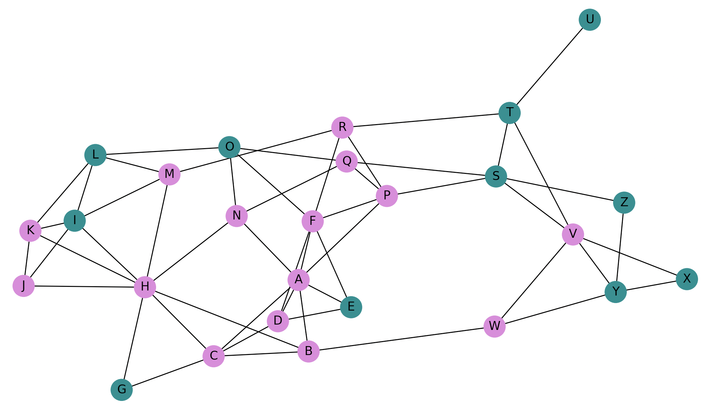

# School Life

**CISC320 Spring 2023 Lesson 19 - Graph Applications**

Group Members:

- Aparna Roy (aparnar@udel.edu)
- Emma Frampton (eframpt@udel.edu)
- Sakhee Desai (sakheed@udel.edu)
- Fourth member (email)

Our project's theme is school. (elaborate on project description later)

## Installation Code

```sh
$> pip install networkx
```

## Python Environment Setup

```python
import networkx as nx
import matplotlib.pyplot as plt
import pprint
import json
```

# First Problem Title (for DFS)

**Informal Description**:

> **Formal Description**:
>
> - Input:
> - Output:

**Graph Problem/Algorithm**: [DFS/BFS/SSSP/APSP/MST]

**Setup code**:

```python

```

**Visualization**:


**Solution code:**

```python

```

**Output**

```

```

**Interpretation of Results**:

---

# Finding Empty Nearby Classrooms

**Informal Description**:
A group of school students wants to find an empty classroom to be able to work on their group project together, but they don't want to have to walk too far to find one. So, the problem is to find all the empty classrooms that are less than 3 hallways away so that the students know their options.

> **Formal Description**:
> Create a map of all the classrooms in a one-story school building, with nodes representing classrooms and edges representing hallways.
> Problem: A group of students needs to find a quiet space to work on their group project, but they don't want to walk too far.
> Find all the empty classrooms that are less than 3 hallways away from their current location, Classroom A.
>
> - Input: A graph of classrooms in a one-story school building, with nodes representing classrooms and edges representing hallways.
> - Output: A list of classrooms that are empty and less than 3 hallways away from Classroom A.

**Graph Problem/Algorithm**: BFS

**Setup code**:

```python
# Create the graph
G = nx.Graph()

# Add nodes to graph
# Empty Classrooms
G.add_nodes_from(['L', 'I', 'G', 'E', 'O', 'S', 'T', 'U', 'X', 'Y', 'Z'], empty=True)
# Non-Empty Classrooms
G.add_nodes_from(['M', 'K', 'J', 'H', 'C', 'B', 'D', 'A', 'N', 'F', 'P', 'Q', 'R', 'V', 'W'], empty=False)

# Add edges to graph
G.add_edges_from([('R', 'F'), ('N', 'H'), ('V', 'Y'), ('L', 'O'), ('R', 'M'), ('B', 'W'), ('M', 'L'), ('M', 'H'), ('M', 'I'), ('L', 'I'), ('L', 'K'), ('K', 'I'), ('K', 'J'), ('K', 'H'), ('J', 'I'), ('J', 'H'), ('I', 'H'), ('H', 'G'), ('H', 'C'), ('H', 'B'), ('G', 'C'), ('B', 'C'), ('C', 'D'), ('C', 'A'), ('B', 'A'), ('A', 'D'), ('D', 'E'), ('D', 'F'), ('A', 'F'), ('A', 'E'), ('E', 'F'), ('A', 'N'), ('A', 'P'), ('N', 'O'), ('F', 'O'), ('N', 'Q'), ('F', 'P'), ('P', 'Q'), ('O', 'Q'), ('P', 'R'), ('P', 'S'), ('Q', 'S'), ('R', 'T'), ('S', 'T'), ('S', 'V'), ('S', 'Z'), ('T', 'U'), ('T', 'V'), ('V', 'X'), ('V', 'W'), ('W', 'Y'), ('X', 'Y'), ('Y', 'Z')])

# Color classroom nodes based on if they are empty (teal) or not empty (orchid color)
color_map = nx.get_node_attributes(G, "empty")
for key in color_map:
    if color_map[key] == True:
        color_map[key] = "teal"
    else:
        color_map[key] = "orchid"

classroom_colors = [color_map.get(node) for node in G.nodes()]

# Show graph of all classrooms
plt.figure()
nx.draw_networkx( G, node_size=450, node_color=classroom_colors, arrows=False, with_labels=True)
plt.show()
```

**Visualization**:



**Solution code:**

```python
# Apply BFS to find all nodes less than 3 hallways away from Classroom A
two_away = nx.descendants_at_distance(G, 'A', 2)
one_away = nx.descendants_at_distance(G, 'A', 1)

# All classooms that are close (< 3 hallways away)
close_rooms = one_away.union(two_away)

# Filter out non-empty classrooms from Graph
empty_and_close = [node for node in close_rooms if G.nodes[node]["empty"] == True]
# Final Output: all rooms less than 3 hallways away that are empty
print("Empty Nearby Classrooms: ", empty_and_close)
```

**Output**

```
Empty Nearby Classrooms:  ['S', 'G', 'E', 'O']
```

**Interpretation of Results**:
Classrooms S, G, E, and O, are both empty and also less than 3 hallways away from Classroom A. The students will now be able to easily decide from this list of classrooms where they want go to work on their group project.

---

# Finding the Shortest Cross Country Trail (for Dijkstra's)

**Informal Description**: A high school cross country team practices for meets at their local park trail. Every runner must start at Point A, and get to the coach who is waiting at Point T, but there are a number of running trails in the park as shown in the graph. One cross country runner wants to find the shortest path from Point A to T. 


> **Formal Description**:
>
> - Input: A Graph G where each edge weight represents the time to run that trail. 
> - Output: The shortest path, with its length, followed by the list of nodes to take. 

**Graph Problem/Algorithm**: SSSP

**Setup code**:

```python
G = nx.Graph()

nodes = [["A", 1, 1],["B", 1, 2],["C", 2, 1],["D", 3, 4],["E", 3, 1],["F", 3, 7],["G", 4, 7],["H", 4, 2],["I", 5, 4],["J", 5, 7],["K", 6, 2],["L", 7, 1],["M", 8, 1],["N", 7, 4],["O", 6, 5],["P", 6, 8],["Q", 7, 8],["R", 8, 2],["S", 8, 4],["T", 8, 8]]

for node in nodes:
    G.add_node(node[0], pos = (node[1], node[2]))

edges = [
    ["A", "B", 6],
    ["A", "C", 2],
    ["C", "E", 7],
    ["C", "D", 9],
    ["B", "D", 7],
    ["D", "F", 3],
    ["F", "G", 7],
    ["G", "I", 7],
    ["D", "H", 2],
    ["H", "I", 20],
    ["G", "J", 3],
    ["J", "O", 30],
    ["I", "O", 3],
    ["I", "K", 10],
    ["K", "L", 5],
    ["L", "M", 5],
    ["M", "R", 2],
    ["R", "S", 10],
    ["S", "T", 12],
    ["K", "N", 12],
    ["O", "N", 3],
    ["O", "P", 7],
    ["P", "Q", 7],
    ["Q", "T", 7],
]

for pair in edges:
    G.add_edge(pair[0], pair[1], weight = int(pair[2]))

#Drawing Graph: 

# nodes
nx.draw_networkx_nodes(G, pos = nx.get_node_attributes(G,'pos'), node_size=700)

# edges
nx.draw_networkx_edges(G, pos = nx.get_node_attributes(G,'pos'), width=6)
nx.draw_networkx_edges(G, pos = nx.get_node_attributes(G,'pos'), width=6, alpha=0.5, edge_color="b")

# node labels
nx.draw_networkx_labels(G, pos = nx.get_node_attributes(G,'pos'), font_size=10, font_family="sans-serif")

# edge weight labels
edge_labels = nx.get_edge_attributes(G, "weight")
nx.draw_networkx_edge_labels(G, pos = nx.get_node_attributes(G,'pos'), edge_labels=edge_labels)

ax = plt.gca()
ax.margins(0.08)
plt.axis("off")
plt.tight_layout()
plt.show()

```
**Visualization**:


**Solution code:**

```python
def solution (G: nx.Graph) -> nx.Graph:
    solution = nx.single_source_dijkstra(G, "A", "T")
    print("The shortest path from Point A to Point T is: ")
    print(solution)
    return solution

solution(G)

```

**Output**

```
The shortest path from Point A to Point T is: 
(52, ['A', 'C', 'D', 'F', 'G', 'I', 'O', 'P', 'Q', 'T'])
```

**Interpretation of Results**:

The output above shows that the shortest way to get from Point A to Point T is to follow the path 
A -> C -> D -> F -> G -> I -> O -> P -> Q - -> T. And considering the weights represent the amount of time for each path, this would take the cross country runner 52 mins to get to his coach at Point T. 

# Fourth Problem Title (for Prim's/Kruskal's)

**Informal Description**:

> **Formal Description**:
>
> - Input:
> - Output:

**Graph Problem/Algorithm**: [DFS/BFS/SSSP/APSP/MST]

**Setup code**:

```python

```

**Visualization**:


**Solution code:**

```python

```

**Output**

```

```

**Interpretation of Results**:
